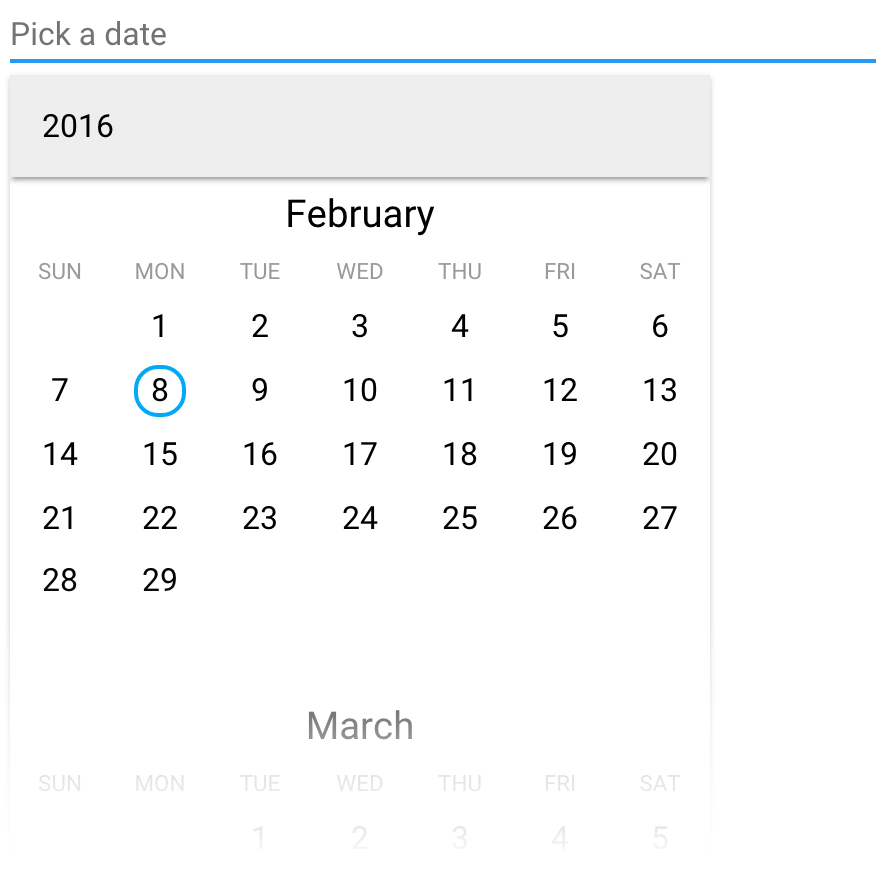

[[vaadin-date-picker.overview]]
= Overview

The [elementname]#vaadin-date-picker# element is a date selection field with a scrollable month calendar view.
The UI opens up as a dropdown when the element gets clicked/tapped and determines a display mode (either fullscreen or desktop) according to the screen dimensions.
The user can navigate to a desired month by scrolling the list of years and months and select a date.

There's a 'today' button for quickly jumping to the current month and a 'cancel' button for closing the dropdown on the dropdown footer.
When a date is selected, the user can clear the value with a button on the right side of the selection.

The current alpha version has a limited set of features.
Future versions will address issues such as date ranges and keyboard input.

[[figure.vaadin-date-picker.overview]]
.A screenshot of vaadin-date-picker

